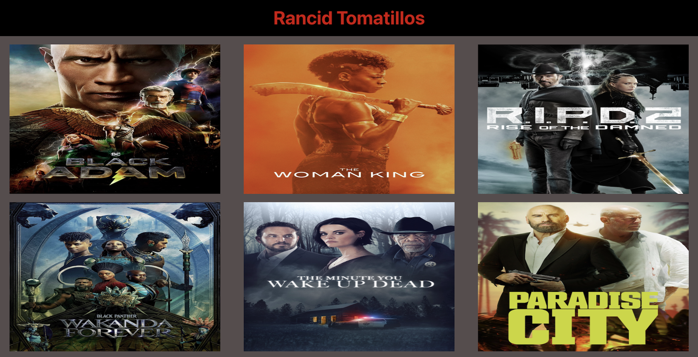
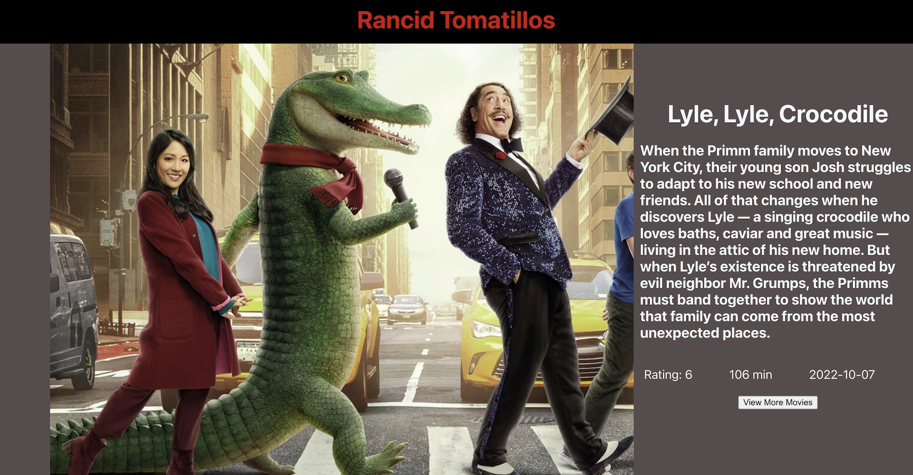

# [rancid-tomatillos](https://github.com/mrlobatoman/rancid-tomatillos)

### Abstract:
This is an interactive web-based application that was developed to make the user's experience for looking at the latest movies, their summary, runtime, release date, and the average user rating.

### Installation Instructions:

OR- [deploy-project](https://rancid-tomatillos-mc1goqky4-mrlobatoman.vercel.app/) 

1. Open your terminal and navigate to where you would like to store the repository.
3. Using the `SSH` key, paste `git clone git@github.com:mrlobatoman/rancid-tomatillos.git` into your terminal.
4. `cd` into the repository on your local machine and run `npm install` or `npm i` to install project dependencies.
5. Run `npm start` to launch the app.

### Preview of App:

### Context:

This project was completed in the 14th week of the Turing front-end software engineering program. This is our first time creating a project utilizing React and Cypress. 

### Contributors:

- [Michael](https://github.com/mrlobatoman)
- [Cade](https://github.com/cadechaney)

### Learning Goals:

- Use React with an understanding of how components should be utilized
- Implement Route instead of using render logic
- Understand and work with JSX
- Implement UI testing using Cypress
- Insure correct data is being passed into each component via PropTypes
- Make network requests using the fetch API to retrieve data to a local server
- Create a user interface that is easy to use, clearly displays information, and follows best practices for accessibility

### Technologies Used:
- Fetch API
- Git/GitHub/Trello
- JavaScript
- CSS
- HTML
- JSX
- PropTypes
- Cypress